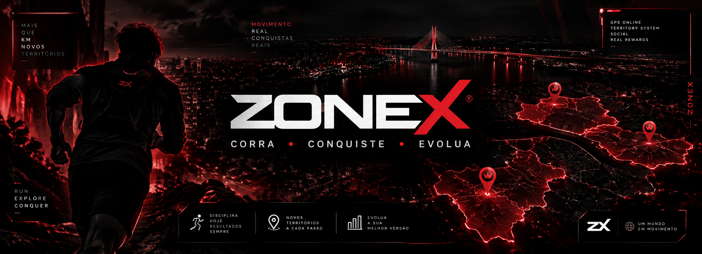

  

 

# ZONEX

> **Corra. Conquiste. Evolua.**

O **ZONEX** é um aplicativo mobile de corrida e caminhada que transforma atividades físicas em uma experiência interativa de exploração, conquista territorial e progressão.

A proposta do projeto é incentivar a prática de atividades físicas através da combinação de **GPS, gamificação, competição e interação social**, permitindo que os usuários transformem suas corridas em conquistas dentro do universo ZONEX.

---

## Sobre o projeto

O ZONEX busca tornar caminhadas e corridas mais envolventes através de um sistema no qual o mundo real se transforma em um mapa de competição.

Durante uma atividade, o usuário poderá percorrer trajetos utilizando o GPS do dispositivo. Ao completar determinadas rotas, áreas poderão ser transformadas em territórios associados ao jogador.

Esses territórios poderão posteriormente ser disputados por outros usuários, criando uma experiência que combina atividade física, exploração e competição.

---

## Principais funcionalidades

O projeto foi planejado para possuir recursos como:

- Cadastro e login de usuários
- Perfil personalizado
- Sistema de níveis e progressão
- Monitoramento de corrida e caminhada
- Rastreamento de percurso por GPS
- Mapa interativo
- Sistema de conquista de territórios
- Estatísticas de atividades
- Missões diárias
- Ranking entre jogadores
- Sistema de clãs
- Personalização de avatar
- Loja de itens cosméticos
- Sistema de pontos **ZX**
- Recompensas e benefícios
- Integração com serviços e dispositivos esportivos

> **Nota:** algumas funcionalidades ainda estão em desenvolvimento e atualmente podem estar representadas por interfaces ou dados simulados.

---

## Sistema de territórios

Um dos principais conceitos do ZONEX é transformar o percurso realizado pelo usuário em uma forma de interação com o mapa.

A proposta é permitir que determinadas rotas percorridas durante uma corrida possam formar áreas conquistadas pelo jogador.

Outros usuários poderão disputar essas regiões através de suas próprias atividades, criando uma competição territorial baseada em movimentação no mundo real.

---

## Perfil e progressão

Cada jogador possui um perfil dentro do ZONEX, onde poderão ser apresentados dados como:

- Nível
- Experiência
- Distância percorrida
- Atividades realizadas
- Territórios conquistados
- Estatísticas de desempenho
- Conquistas

O sistema de progressão busca recompensar a constância do usuário e incentivar a realização de novas atividades.

---

## Avatar

O ZONEX possui um sistema de avatar que representa o jogador dentro do aplicativo.

A proposta inclui diferentes opções de personalização, como roupas, calças, jaquetas, conjuntos, tênis, acessórios, mochilas, emotes e títulos.

Novos itens poderão ser desbloqueados através da progressão ou adquiridos utilizando recursos disponíveis dentro do aplicativo.

---

## Missões e recompensas

O sistema de missões tem como objetivo incentivar o usuário a manter uma rotina ativa.

As missões poderão envolver desafios relacionados à distância percorrida, quantidade de atividades, conquista de territórios, metas específicas e desafios diários.

A conclusão dessas atividades poderá gerar recompensas e pontos **ZX**.

---

## Sistema ZX

**ZX** é o sistema de pontos planejado para o ecossistema ZONEX.

Os pontos poderão ser utilizados dentro do aplicativo para desbloquear conteúdos e participar do sistema de recompensas.

O projeto também prevê a possibilidade de parcerias que permitam oferecer benefícios aos usuários através de estabelecimentos parceiros.

---

## Sistema anti-trapaça

O projeto prevê mecanismos para identificar atividades incompatíveis com caminhada ou corrida.

Entre as verificações planejadas estão análises de velocidade e comportamento do deslocamento, reduzindo a possibilidade de utilização de veículos ou outros métodos para obter vantagens indevidas.

---

## Integrações

O planejamento do ZONEX inclui futuras integrações com plataformas e dispositivos relacionados à atividade física, permitindo ampliar as informações disponíveis sobre os exercícios realizados.

Entre as integrações estudadas estão serviços esportivos, GPS e dispositivos vestíveis.

---

## Tecnologias

O aplicativo Android utiliza tecnologias como:

- **Kotlin**
- **Jetpack Compose**
- **Android Studio**
- **Gradle**
- **Git**
- **GitHub**

A arquitetura e as tecnologias utilizadas poderão evoluir conforme novas funcionalidades forem implementadas.

---

## Status do projeto

**Em desenvolvimento.**

Atualmente, o projeto possui uma interface Android funcional com diferentes telas e fluxos de navegação implementados.

As próximas etapas envolvem evoluir as funcionalidades visuais para sistemas completos, incluindo persistência de dados, autenticação, GPS, atividades esportivas e serviços de backend.

---

## Identidade visual

O ZONEX utiliza uma identidade visual baseada principalmente em **vermelho e preto**, com inspiração tecnológica e competitiva.

A proposta visual busca transmitir velocidade, evolução, competição e tecnologia.

---

## Equipe

Projeto desenvolvido por estudantes de **Análise e Desenvolvimento de Sistemas (ADS)**.

**Equipe ZONEX**

- Guilherme
- Licoln
- João Gabriel
- Tales

---

## Projeto acadêmico

O ZONEX está sendo desenvolvido como um projeto acadêmico do curso de **Análise e Desenvolvimento de Sistemas (ADS)**.

O projeto busca aplicar conceitos de desenvolvimento mobile, engenharia de software, experiência do usuário, integração de serviços e desenvolvimento de sistemas.

---

## Objetivo

O objetivo do ZONEX é explorar uma nova maneira de incentivar a atividade física através da tecnologia.

Em vez de apenas registrar uma corrida:

### **Cada percurso pode se tornar uma conquista.**

---

# ZONEX

**CORRA • CONQUISTE • EVOLUA**

